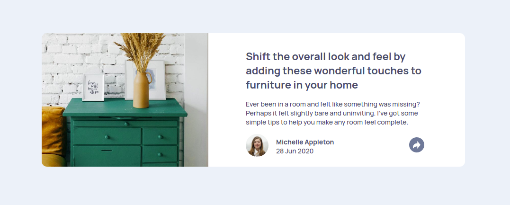

# Frontend Mentor - Article preview component

This is a solution to the [Article preview component on Frontend Mentor]https://www.frontendmentor.io/challenges/article-preview-component-dYBN_pYFT. Frontend Mentor challenges help you improve your coding skills by building realistic projects. 

## Overview

### The challenge

- Build out the project to the designs provided

### Screenshot

### Links

- Live Site URL: [github-pages](https://dehfachini.github.io/article-preview-component-master/)

## My process

### Built with

- Semantic HTML5 markup
- CSS custom properties
- Accordion made with vanilla JS

### To Do

- Mobile Design

## Author

- Website - [Débora](https://github.com/dehfachini)
- Frontend Mentor - [@dehfachini](https://www.frontendmentor.io/profile/dehfachini)

